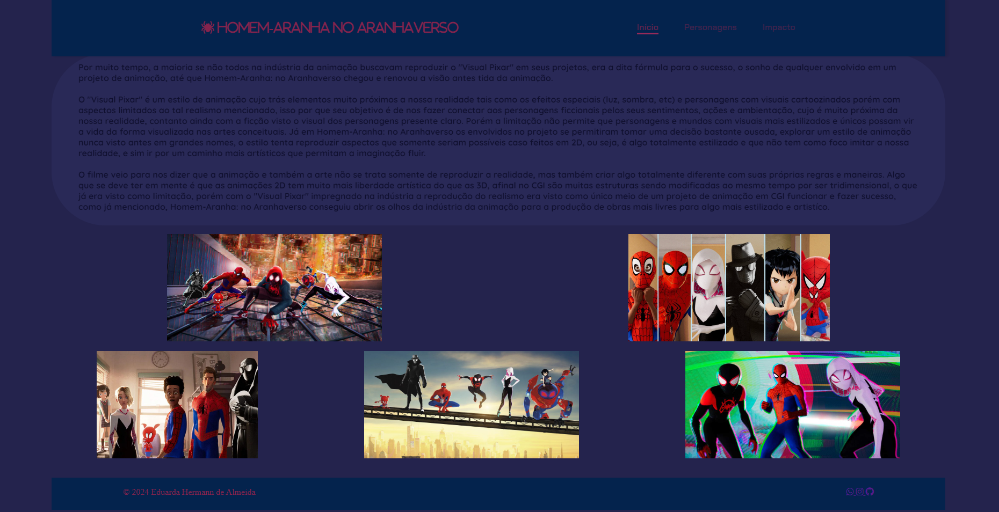

### Descrição:
O repositório ProjPessoal armazena um Projeto Pessoal proposto no Curso Técnico de Informática do Colégio ULBRA São Lucas, um site, cujo deveria ser feito com inspiração no Website construído junto do professor em aula, chamado Projeto CAKE, 
você pode acessá-lo a partir deste link: https://github.com/eduardahermannalmeida/ProjCake. Foi desenvolvido com a ideia de ser um site informativo quanto ao filme "Homem-Aranha: no Aranhaverso", um filme que admiro muito pelo seu valor artístico
e inovação. No site é possível encontrar informações do filme como: Sínopse, Ficha Técnica, Personagens e Impacto do filme.

## Ficha Ténica:

Desenvolvedor(a): @eduardahermannalmeida 

Linguagens:

Software:

- Ícones:

https://www.iconfinder.com

Header/Footer (README.md):

https://leviarista.github.io/github-profile-header-generator/

## Preview:

### Sobre
Nesta seção estão as informações sobre o filme.

### Personagens
Esta é a parte do site em que os personagens principais da obra são descritos.

### Impacto
Aqui é possível ver um texto falando sobre o impacto que o filme teve na indústria da animação.

